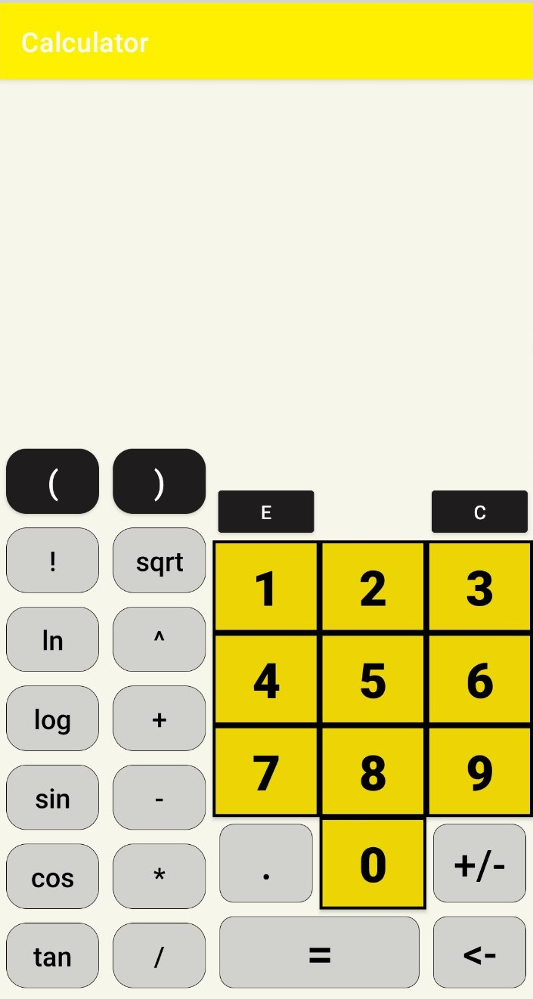

# Calculator App
This app performs simple arithmetic operations, besides it supports:
* Factorial (!)
* Power (^)
* Square root (sqrt)
* Trigonometric functions (sin, cos, tan, all take degrees as an input)
* Logarithms (natural logarithm, log base 10 (syntax:log10()) and log base 2 (syntax:log2()))
* Scientific notation (E)
## Motivation 
This project was created as an introduction to Android App development using Android Studio. 
Calculator provided as deafult does not entairly suit my needs, therefore I have decided to build one of my own, with some part of scientific operations right on the front screen.
## Design
Idea: Equation is stored as a string and then calculated using [mXparser](https://github.com/mariuszgromada/MathParser.org-mXparser).  

Colors: Yellow, black, grey and white are official colors of the Michigan Technological University.

Icon: For the icon graphics provided by Android Studio has been used.

## Layout

Layout is scalable to most screen sizes.

